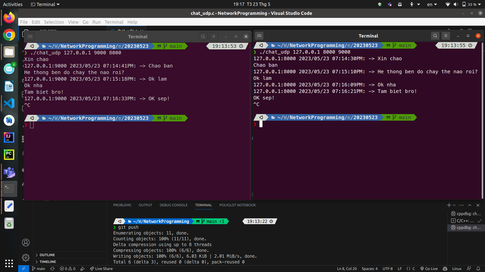

# BÀI TẬP TRÊN LỚP SỐ 02 NGÀY 23/05/2023

***Bài 02.01.*** Sử dụng hàm select/poll, lập trình ứng dụng server thực hiện các chức năng sau:

- Khi client được chấp nhận thì server gửi xâu chào kèm theo số lượng client đang kết nối. Ví dụ: “Xin chào. Hiện có 15 clients đang kết nối.”
- Khi client gửi xâu ký tự thì server thực hiện chuẩn hóa xâu ký tự và trả lại kết quả cho client. Việc chuẩn hóa xâu bao gồm:

  - Xóa ký tự dấu cách ở đầu xâu, cuối xâu và ký tự không hợp lệ (giữa các từ chỉ có 1 dấu cách).

  - Viết hoa chữ cái đầu các từ, các ký tự còn lại viết thường.

- Khi client gửi “exit” thì server gửi xâu chào tạm biệt và đóng kết nối.

***Bài 02.02.*** Sử dụng hàm select/poll, lập trình ứng dụng chat giữa 2 máy sử dụng giao thức UDP. Địa chỉ IP, cổng của máy nhận và cổng chờ được nhập từ dòng lệnh

